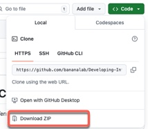
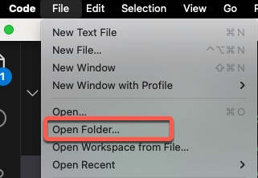
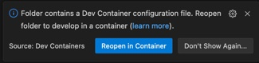

# Download code examples

Once our development environment is set up with Visual Studio Code and Docker we're ready to install the code that we'll be studying for this video.

The process is very simple:

1. Open a browser to the [Github repository for this video](https://github.com/bananalab/Developing-Infrastructure-as-Code-with-Terraform-2).

2. Download and extract the code.

3. Open the code with Visual Studio Code.

4. Reopen the project in the Dev Container.

> Note: If the the popup disappears select 'View/Command Pallete' from the application menu, then select 'Dev Containers: Build and open in container'