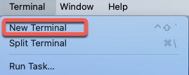

# Lesson 01: Terraform Fundamentals

## 🎯 Learning Objectives
- Understand Terraform basic syntax
- Create your first Terraform configuration
- Learn about outputs and basic commands

## 📁 Exercises

### 1.3 Hello Terraform
**File:** `1.3_hello_terraform/hello.tf`

```hcl
output "hello" {
  value = "Hello world."
}
```

**Commands to run:**
```bash
cd 1.3_hello_terraform
terraform init
terraform plan
terraform apply
terraform output
```

**Expected Output:**
```
hello = "Hello world."
```

## 🔑 Key Concepts Learned
- Terraform configuration syntax
- Output blocks
- Basic Terraform workflow (init → plan → apply)
- State file management

## 📸 Screenshots


## ✅ Completion Status
- [x] Basic syntax understanding
- [x] First successful terraform apply
- [x] Output values working
- [x] State file generated

## 🚀 Next Steps
Move to Lesson 03 for resource management and AWS integration.
